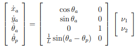

# MATLAB simulation of a unicycle robot with a trailer. 

The following kinematics model has been used (bicycle with front axis $L_m$ = $L$):

The desired behavior is to follow the y-axis with a constant velocity v which implies $y_{des}$ = $\theta_{des, a}$ = $\theta_{des, p}$ = $0$.

The following Lyapunov control law has been used:

 

 **To run the code:**
 
* 1: Start and run the  `init_params_unicycle.m` script, which defines the initial values of the model
* 2: Start and run `unicycle_w_trailer.sxl`, that is the Simulink model of the unicycle with trailer
* 3: Start and run the  `model_plot.m` scrpit, which creates the plots to visualize the results