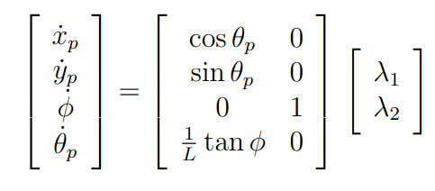

<!-- # MATLAB simulation of a unicycle robot with a trailer and a rear-wheel drive. 


The following kinematics model has been used (bicycle with back axis $L_m$ = $0$):



In this case, $\lambda_1$ is the rear unicycle forward speed and $\lambda_2$ is the angular speed of steering.

**NOTE** that this kinematic model is valid only if the steering angle $\phi \neq \pm \pi / 2$.

The desired behavior is to follow the y-axis with a constant velocity v which implies $y_{des}$ = $\theta_{des, a}$ = $\theta_{des, p}$ = $0$.

The following Lyapunov control law has been used:

 

 **To run the code:**
 
* 1: Start and run the  `rw_init_params_unicycle.m` script, which defines the initial values of the model
* 2: Start and run `rw_unicycle_w_trailer_rw.sxl`, that is the Simulink model of the unicycle with trailer
* 3: Start and run the  `rw_model_plot.m` scrpit, which creates the plots to visualize the results -->

# MATLAB Simulation of a Unicycle Robot with Trailer and Rear-Wheel Drive

This repository contains a simulation of a **rear-wheel driven unicycle robot with a trailer**,
implemented in MATLAB and Simulink. The goal is to model and control the system so that the
robot follows the y-axis using a Lyapunov-based control law.

## Project Structure

The files included in this project are:

- `rw_init_params_unicycle.m` — MATLAB script that sets the model's initial parameters.
- `rw_model_plot.m` — Script to generate plots and visualize simulation results.
- `rw_unicycle_w_trailer.slx` — Simulink model of the unicycle robot with trailer.

## Kinematic Model

The simulation is based on a **rear-wheel unicycle kinematic model** with back axis  $L_m = 0$:


In this model:
- $\lambda_1$ represents the forward velocity of the unicycle.
- $\lambda_2$ represents the angular steering velocity.

> **NOTE:** This model is only valid when the steering angle $\phi \neq \pm\frac{\pi}{2}$, that is when the front axle is not perpendicular to the back axle.

## Control Objective

The objective of the controller is to **make the robot follow the y-axis** with a constant velocity $v$.
This results in the following desired values:

$y_{des} = \theta_{des,a} = \theta_{des,p} = 0$

## Control Law

The simulation uses a **Lyapunov-based control law** to ensure stability and convergence to the desired path.


## How to Run the Simulation

To execute the simulation, follow these steps in MATLAB:

1. **Initialize Parameters**
   - Run the following script to set up the initial conditions:
     ```
     rw_init_params_unicycle.m
     ```

2. **Run the Simulink Model**
   - Open and simulate the model:
     ```
     rw_unicycle_w_trailer.slx
     ```

3. **Plot the Results**
   - Generate visualizations by running:
     ```
     rw_model_plot.m
     ```

## Additional Notes

- Ensure that all required image files (`rear_wheeled_bicycle.png`, `image-2.png`, `image-3.png`) are in the root directory.
- File naming should be consistent. Make sure the model file is correctly named as `rw_unicycle_w_trailer.slx`.

## License

This project is for educational and research purposes only. Feel free to modify and extend it.
